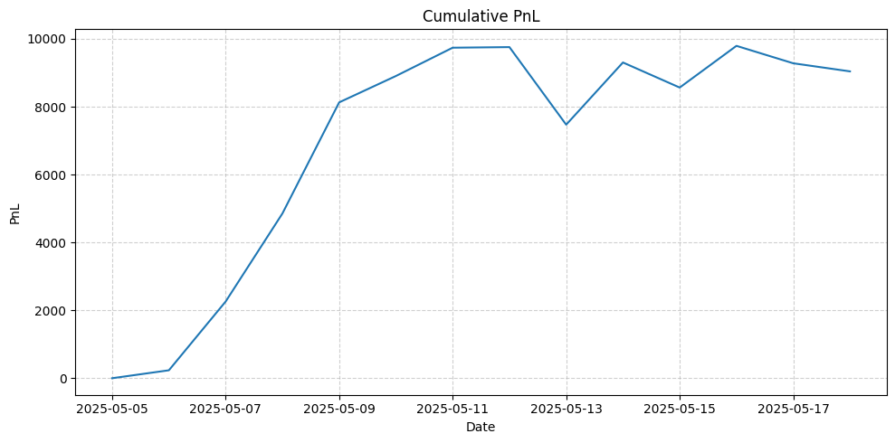
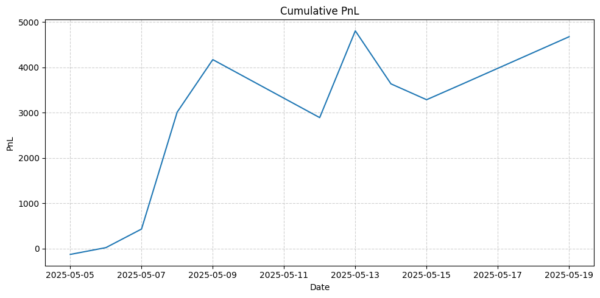

This is a simple backtester for options trading strategies. I originally designed it for crypto options, but it can also be used for other types of options.

It takes in a series of day-by-day positions on various products (both options and underlying), producing a PnL graph and Sharpe ratio. Options auto-exercise at expiry if appropriate.

Example output for constant +1 position of BTC-USD (underlying):

Sharpe ratio: 8.7188

Example output for constant +1 position of BTC-USD June 2025 call option with 100k strike:

Sharpe ratio: 6.4083

